<h1 align="center">KS 的时间轴笔记工具</h1>

    <strong>▶️ 纯前端实现，轻便实用的本地媒体笔记工具</strong>

 
<h3 align="center">
    <a href="http://ks233.github.io/video-annotator/">开始使用</a>
     • 
    <a href="http://ks233.github.io/video-annotator/?n=https://raw.githubusercontent.com/ks233/va-example/refs/heads/main/Introduction.txt">DEMO</a>
     • 
    <a href="https://github.com/ks233/video-annotator/issues">BUG 反馈</a>
</h3>

    <a href="https://github.com/ks233/video-annotator">
        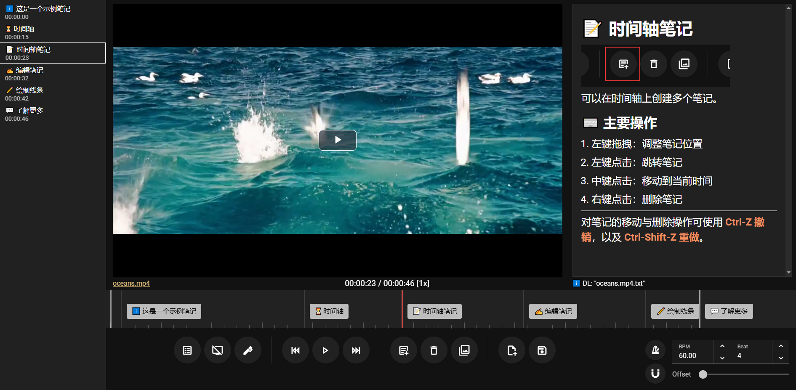
    </a>

## 主要特性

- 在时间轴上标记重点，准确定位，随时跳转。
- 用 Markdown 做笔记，保存为单个 JSON 文件，非常轻便。
- 能直接在画面上绘制线条，圈画关键点。
- 内置节拍器、拍点吸附等功能，便于分析音乐。
- 纯前端，一切发生在本地，没有隐私顾虑。

## 使用方式

这个工具非常简单直观，操作基本上就是点击、拖拽，按钮看图标点两下就能知道用途。

如果你正在使用电脑浏览器，可以直接查看这个[示例笔记](https://ks233.github.io/video-annotator/?n=https://raw.githubusercontent.com/ks233/va-example/refs/heads/main/Introduction.txt)。

### 时间轴操作

- 左键拖拽平移时间轴，滚动滚轮缩放时间轴。
- 左键点击笔记跳转到笔记所在的时间（也可以用左侧的笔记列表跳转）。
- 左键拖拽调整笔记位置。
- 中键点击笔记移动到当前时间。

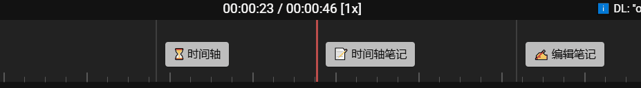

- 右键点击笔记将其删除。所有移动和删除都可以用 `Ctrl-Z` 撤销，`Ctrl-Shift-Z` 重做。

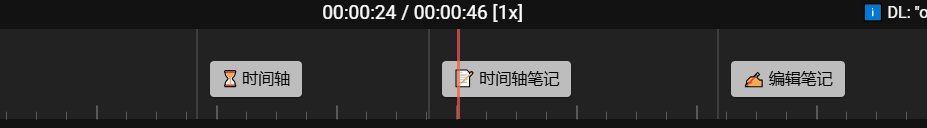

### 播放器快捷键

- 空格：播放 / 暂停
- 左右：前进 / 后退 5s
- 上下：音量 +10% / -10%
- `X` 减速，`C` 加速，`Z` 切换原速和变速
- `D` 上一帧，`F` 下一帧

### 载入与保存文件

**直接把文件拖进网页**即可载入视频或笔记文件，也可以**同时选中视频和笔记一起拖拽载入**。界面上也有载入按钮，但还是拖拽方便一些。

图中这两个按钮分别是从本地载入和从链接载入。从链接载入也支持加载 YouTube 视频，但不太稳定。

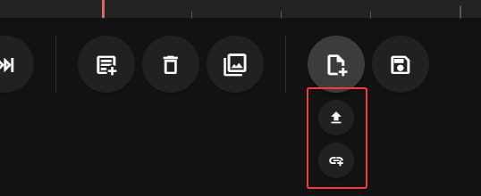

用 `Ctrl-S` 或界面上的按钮可以保存笔记。**如果使用  Chromium 内核的浏览器，保存时会直接写入原文件，使用其它浏览器则会下载笔记文件**。

### 编辑笔记

本工具内置了 Markdown 编辑器组件，用快捷键 `Ctrl-E` 或按钮切换编辑模式和预览模式。

笔记的第一行会成为该笔记的标题，可以在标题中插入 Emoji，使其更加醒目，编辑器的工具栏提供了一些常用的 Emoji。

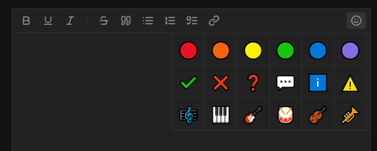

当笔记的第一个字符是英文句号 `.` 时，笔记会在时间轴上显示为次级笔记，次级笔记不会在播放时被选中，只有在暂停时手动选中才会显示内容。

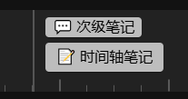

### 插入图片

如果要插入网页图片，直接用 markdown 的语法 `` 即可。如果要插入本地图片，点击这个按钮打开“图床”窗口：

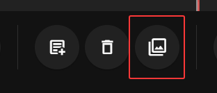

然后 `Ctrl-V` 插入图片，图片将得到随机的别名，并以 base64 的形式保存在 JSON 文件中，点击图片标题可以修改别名，点击图片可以直接插入笔记中。

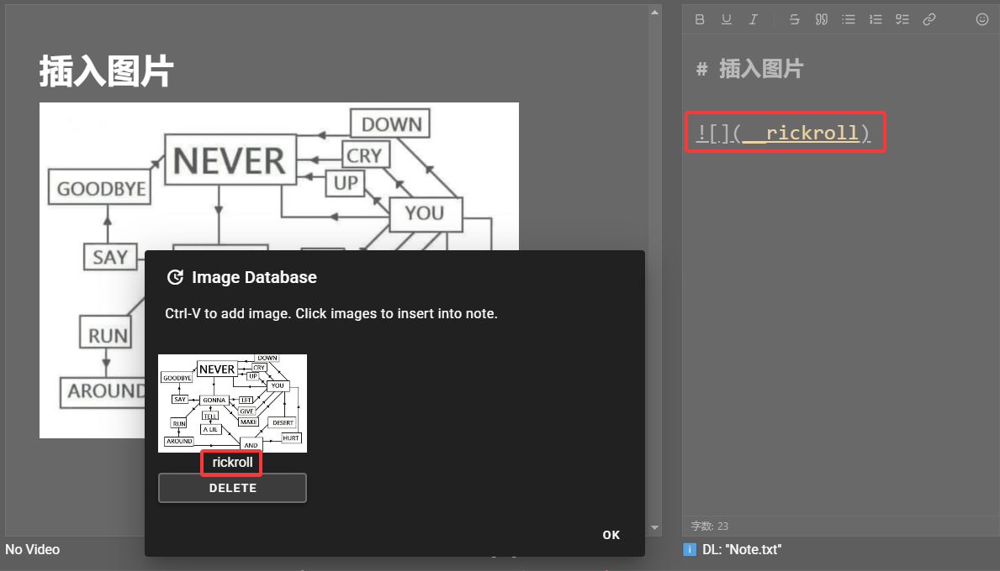

插入本地图片的语法是 ``，只是多了两个下划线。

### 音乐相关

音乐分析功能示例可以查看这个[演示笔记](http://ks233.github.io/video-annotator/?n=https://raw.githubusercontent.com/ks233/va-example/refs/heads/main/Music.txt)。

设置右下角的三个参数对齐音乐节拍：

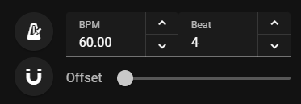

- BPM：节拍器的速度，也是时间轴上刻度线的密度。
- Beat：一小节的拍数，每小节的第一拍的刻度线稍长一些，节拍器的音效也不同。
- Offset：音乐不一定从第 0 秒开始，所以需要调整偏移量，最多偏移一整个小节。

调整好以上参数，打开节拍器并播放视频，节拍器就能正确地对准音乐节奏。

为了使笔记位置也能准确地对齐节奏，点击磁铁按钮开启吸附模式：

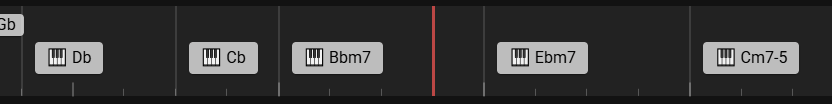

右键点击磁铁按钮会使所有笔记就近吸附到刻度线，可以在微调刻度线参数之后快速将笔记重新对齐。

挨个创建和弦笔记比较麻烦，可以用中键点击“创建笔记”按钮，在弹出的输入框中批量输入和弦记号。和弦记号用英文逗号 `,` 隔开，每个和弦间隔半小节，逗号之间没有内容则视为跳过半小节。（所以两个逗号 = 一小节，四个逗号 = 两小节）

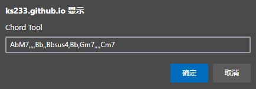

### 绘制线条

在当前位置有笔记时，按住 `Ctrl`，屏幕变蓝之后左键绘制，右键擦除。线条将以点坐标列表的形式存储在笔记中。绘制的线条会自动适应播放器大小的变化，始终保持位置正确。

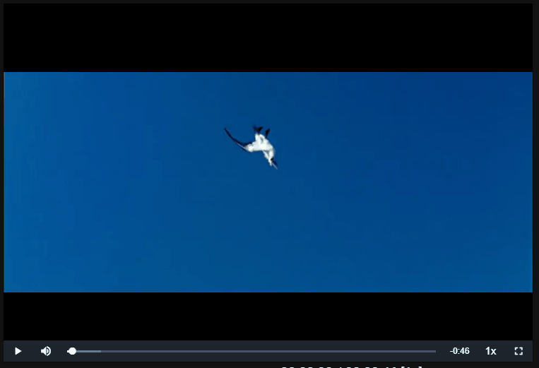

## 相关项目

因为想要复盘游戏录像、分析音乐学习编曲，我需要一个能在时间轴上做笔记的工具。但找了很多方案后并没有满意的：视频剪辑软件太慢太麻烦，字幕编辑软件功能太偏，线上服务（比如 frame.io）又要花钱又要上传视频到服务器。我甚至找到了一个叫 [Kinovea](https://www.kinovea.org/) 的分析运动员动作模式的专业工具，这软件啥都好，又能打轴批注又能圈画，就是没有声音。

这实在是太蛋疼了，于是我决定自己搓一个。

### 时间轴

本项目的时间轴基本模仿了播客平台[机核](https://www.gcores.com/)的网页端播放器：

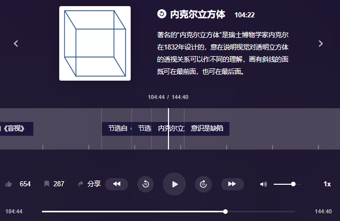

这个设计巧妙地使音频和图文两种媒介的优势互补，既能放松地听音频，也能在需要时从图文中获取更多信息，而且音频 + 图文可比视频小得多。

现在网上很多两三张图一段文字的内容硬要套个模板做成竖屏短视频，信息传递效率极低，相比之下机核的这种设计简直就是一股清流。这么好的设计只用来播放他们自己的播客实在是有点可惜，于是我就自己复刻了一个，实现打轴自由（

### 使用的工具与第三方库

- 前端框架：Vue + Vuetify + Vueuse
- 视频框架：[videojs](https://github.com/videojs/video.js) 和 [videojs-youtube](https://github.com/videojs/videojs-youtube)
- Markdown 编辑器：[imzbf/md-editor-v3](https://github.com/imzbf/md-editor-v3)
- Markdown 渲染：[markedjs/marked](https://github.com/markedjs/marked)、[cure53/DOMPurify](https://github.com/cure53/DOMPurify)
- [ai/nanoid](https://github.com/ai/nanoid)

## 已知问题

因为是纯前端，所以只能载入[浏览器原生支持的媒体格式](https://videojs.com/html5-video-support/)，比如 Chrome 支持 h264 编码的 mp4，以及部分 mov、webm 文件，**而 mkv、avi 等格式的视频就无法导入**。

这是个挺严重的问题，但浏览器不支持我也没辙。好在现在大多数视频还是能直接用浏览器播放的，录像工具也可以设置输出格式，实在不行只能用 ffmpeg 等工具转换一下了。
